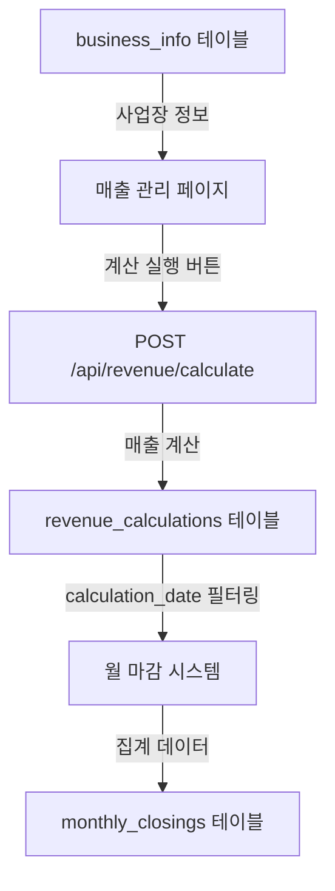

# 월 마감 시스템 데이터 미표시 문제 진단 및 수정 계획

## 📋 문제 진단

### 1. 현재 상황
- **증상**: 월 마감 페이지에 데이터가 하나도 표시되지 않음
- **SQL 실행**: 데이터베이스 테이블(`monthly_closings`, `miscellaneous_costs`)은 정상 생성됨
- **빌드**: 성공적으로 완료
- **개발 서버**: 정상 실행 중

### 2. 근본 원인 분석

#### 🔴 핵심 문제: 데이터 소스 테이블 불일치

**매출 관리 시스템의 데이터 저장 위치:**
```sql
-- 매출 관리에서 사용하는 테이블
revenue_calculations (
  id UUID,
  business_id UUID,
  business_name VARCHAR(255),
  calculation_date DATE,  -- 📅 설치일 기준
  total_revenue DECIMAL,
  sales_commission DECIMAL,
  installation_costs DECIMAL,
  ...
)
```

**현재 월 마감 API가 조회하는 로직:**
```typescript
// ✅ 올바른 테이블 사용 중
const { data: businesses } = await supabase
  .from('revenue_calculations')
  .select('total_revenue, sales_commission, installation_costs, ...')
  .gte('calculation_date', startDate)
  .lt('calculation_date', endDate);
```

#### 🟡 문제점: revenue_calculations 테이블에 데이터가 없음

**원인:**
1. **매출 관리 페이지에서 계산 실행 필요**: `revenue_calculations` 테이블은 사용자가 "매출 계산" 버튼을 눌러야 데이터가 생성됨
2. **자동 계산 없음**: 사업장 정보만 있고, 매출 계산이 실행되지 않았다면 테이블이 비어있음
3. **의존성 체인**: 월 마감 → revenue_calculations → 매출 계산 실행 필요

### 3. 매출 관리 시스템 데이터 흐름



**현재 상태:**
- ✅ business_info: 사업장 정보 있음
- ❌ revenue_calculations: **데이터 없음** (계산 미실행)
- ❌ monthly_closings: 데이터 없음 (소스 데이터 없음)

## 🎯 해결 방안

### 방안 1: 사용자 가이드 제공 (임시 해결)
**장점**: 빠른 해결
**단점**: 사용자가 매번 매출 계산 실행 필요

**절차:**
1. 매출 관리 페이지(`/admin/revenue`) 접속
2. "전체 재계산" 또는 개별 사업장 계산 실행
3. 월 마감 페이지(`/admin/monthly-closing`) 재방문

### 방안 2: 월 마감 자동 계산 강화 (권장)
**장점**: 사용자 경험 향상, 데이터 자동 생성
**단점**: 구현 복잡도 증가

**구현 내용:**
1. **자동 매출 계산 트리거**
   - 월 마감 계산 시 `revenue_calculations`가 비어있으면
   - 자동으로 해당 월의 사업장 매출 계산 실행
   - 계산 완료 후 월 마감 집계

2. **데이터 검증 및 알림**
   - 계산 가능한 사업장 수 표시
   - 누락된 정보가 있는 사업장 알림
   - 계산 진행 상태 실시간 표시

3. **캐시 및 재계산 최적화**
   - 이미 계산된 데이터는 재사용
   - 변경된 데이터만 재계산

### 방안 3: 하이브리드 접근 (최적)
**장점**: 유연성과 성능 균형
**단점**: 구현 시간 소요

**구현 내용:**
1. **첫 로드 시 데이터 검증**
   ```typescript
   // 페이지 로드 시 체크
   const hasRevenueData = await checkRevenueCalculations(year, month);

   if (!hasRevenueData) {
     // 사용자에게 선택지 제공
     showAutoCalculatePrompt(); // "자동 계산하시겠습니까?"
   }
   ```

2. **자동 계산 옵션**
   - 사용자 확인 후 자동 계산 실행
   - 또는 매출 관리 페이지 링크 제공

3. **진행 상황 표시**
   ```
   [진행중] 2024년 12월 매출 계산 중... (3/15 완료)
   ```

## 📊 데이터 구조 검증

### revenue_calculations 테이블 필수 컬럼
```sql
calculation_date DATE NOT NULL,  -- 설치일 (월 마감 필터 기준)
total_revenue DECIMAL(12,2),     -- 총 매출
sales_commission DECIMAL(10,2),  -- 영업비
installation_costs DECIMAL(10,2), -- 설치비
adjusted_sales_commission DECIMAL, -- 조정 영업비 (있으면 사용)
installation_extra_cost DECIMAL    -- 추가 설치비 (있으면 합산)
```

### 현재 API 집계 로직
```typescript
// ✅ 올바른 로직
const totalRevenue = businesses?.reduce((sum, b) =>
  sum + (Number(b.total_revenue) || 0), 0) || 0;

const salesCommission = businesses?.reduce((sum, b) =>
  sum + (Number(b.adjusted_sales_commission) || Number(b.sales_commission) || 0), 0) || 0;

const installationCosts = businesses?.reduce((sum, b) =>
  sum + (Number(b.installation_costs) || 0) + (Number(b.installation_extra_cost) || 0), 0) || 0;

const netProfit = totalRevenue - salesCommission - installationCosts - miscCosts;
```

## 🛠️ 구현 계획

### Phase 1: 즉시 해결 (임시)
**목표**: 사용자가 즉시 사용 가능하도록 가이드 제공

1. **UI 개선**
   - 데이터 없음 상태 안내 메시지 추가
   - 매출 관리 페이지 링크 버튼
   - 필요한 작업 단계 표시

2. **헬프 텍스트**
   ```
   📊 월 마감 데이터를 보려면:
   1. 매출 관리 페이지에서 계산 실행
   2. 해당 월의 사업장 매출 계산 완료
   3. 이 페이지로 돌아와 새로고침
   ```

### Phase 2: 자동화 구현 (권장)
**목표**: 완전 자동화로 사용자 경험 최적화

1. **자동 계산 API 추가**
   ```typescript
   POST /api/admin/monthly-closing/auto-calculate
   {
     year: 2024,
     month: 12,
     force: false // true면 기존 계산 덮어쓰기
   }
   ```

2. **프로세스**
   - 해당 월의 사업장 목록 조회
   - 각 사업장 매출 계산 실행
   - 계산 완료 후 월 마감 집계
   - 진행 상황 실시간 반환

3. **UI 개선**
   - "자동 계산" 버튼 추가
   - 진행 상황 프로그레스 바
   - 완료 후 자동 새로고침

### Phase 3: 데이터 검증 강화
**목표**: 데이터 품질 보장

1. **계산 가능 여부 검증**
   - 필수 정보 누락 체크
   - 가격 정보 존재 확인
   - 설치 정보 유효성 검사

2. **오류 처리**
   - 계산 실패 사업장 목록 표시
   - 누락 정보 상세 안내
   - 재시도 옵션 제공

## 🚀 실행 우선순위

### 1순위: Phase 1 (1-2시간)
- ✅ 빠른 해결
- ✅ 사용자 즉시 사용 가능
- ✅ 구현 간단

### 2순위: Phase 2 (4-6시간)
- ✅ 완전 자동화
- ✅ 최적 사용자 경험
- ⚠️ 구현 시간 소요

### 3순위: Phase 3 (2-3시간)
- ✅ 데이터 품질 보장
- ✅ 오류 최소화
- 📅 점진적 개선

## 💡 사용자 의견 수렴

사용자님께서 "매출관리에서도 설치비를 기준으로 금액이 나오고 있는데 그 데이터를 같이 쓰면 될 것 같아"라고 하신 것이 정확합니다!

**현재 상황:**
- ✅ API 로직은 이미 `revenue_calculations` 테이블을 올바르게 사용 중
- ❌ 문제는 테이블에 데이터가 없다는 것

**해결 방향:**
1. 매출 관리에서 계산 실행 (임시)
2. 또는 월 마감에서 자동 계산 구현 (권장)

어떤 방향으로 진행하시겠습니까?
- A) 빠른 해결: UI 안내 + 매출 관리 연동
- B) 완전 자동화: 자동 계산 기능 구현
- C) 하이브리드: 둘 다 구현
